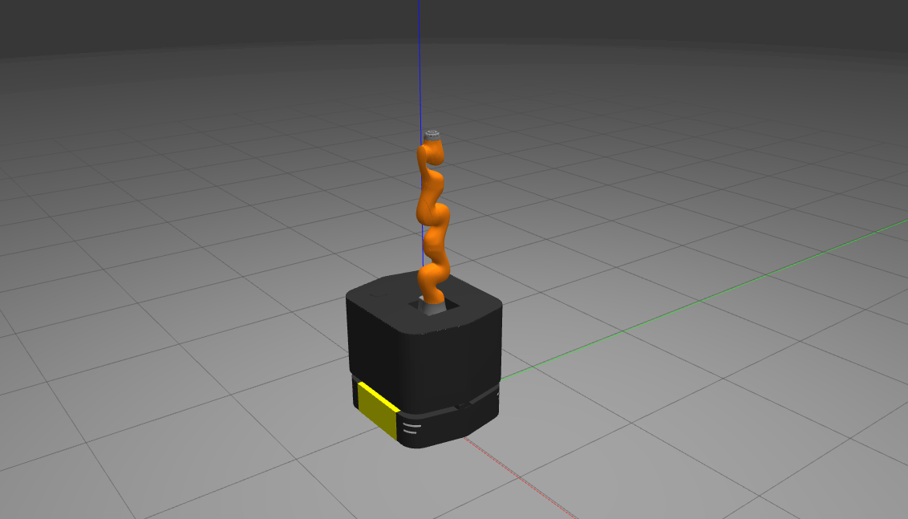

# Ridgeback + iiwa Integration

*Works on **Ubuntu 18.04** with **ROS Melodic**.*



This repository provides our customed ridgeback integration with KUKA LBR iiwa 7 R800 based on [ridgeback_manipulation](https://github.com/ridgeback/ridgeback_manipulation). 


## Installation

1. Clone [iiwa_stack](https://github.com/daeunSong/iiwa_stack) and [iiwa_stack_examples](https://github.com/daeunSong/iiwa_stack_examples) repositories to your workspace:
  ```sh
  mkdir ridgeback_iiwa_ws && cd ridgeback_iiwa_ws && mkdir src
  catkin_init_workspace
  cd src
  git clone https://github.com/IFL-CAMP/iiwa_stack.git
  git clone https://github.com/daeunSong/iiwa_stack_examples.git
  ```

2. Clone [ridgeback](https://github.com/daeunSong/ridgeback), [ridgeback_simulator](https://github.com/daeunSong/ridgeback_simulator), [ridgeback_iiwa_integration](https://github.com/daeunSong/ridgeback_iiwa_integration) repositories to your workspace:
  ```sh
  git clone https://github.com/daeunSong/ridgeback.git
  git clone https://github.com/daeunSong/ridgeback_simulator.git
  git clone https://github.com/daeunSong/ridgeback_iiwa_integration.git
  ```

3. Install the dependencies:
  ```sh
  rosdep install --from-paths src --ignore-src -r -y
  ```

4. Add a following line in ~/.bashrc:

  `export RIDGEBACK_URDF_EXTRAS=$(catkin_find ridgeback_iiwa_description urdf/ridgeback_iiwa_7_description.urdf.xacro --first-only)`

5. Build the workspace:
  ```sh
  catkin build
  ```

6. Source the workspace:
  ```sh
  source devel/setup.bash
  ```


## Demo
Run the following commands in respective terminals:
```sh
roscore 
roslaunch ridgeback_gazebo ridgeback_world.launch
roslaunch ridgeback_navigation odom_navigation_demo.launch
roslaunch ridgeback_viz view_robot.launch config:=navigation
```
```sh
roscore 
roslaunch ridgeback_iiwa_moveit_config demo.launch
```
