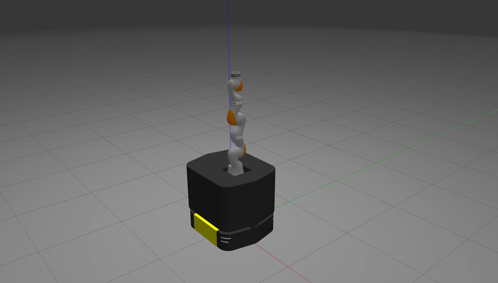

# Ridgeback + iiwa Integration

*Tested on **Ubuntu 18.04** with **ROS Melodic**.*



This repository provides our customed ridgeback integration with KUKA LBR iiwa 7 R800 based on [ridgeback_manipulation](https://github.com/ridgeback/ridgeback_manipulation) and [turtlebot3_manipulation](https://github.com/ROBOTIS-GIT/turtlebot3_manipulation). 


## Build and Compile

1. Clone this repository:
  ```sh
  mkdir ros_ws && cd ros_ws && mkdir src
  catkin_init_workspace
  cd src
  git clone https://github.com/daeunSong/ridgeback_iiwa_integration.git
  ```

2. Clone **iiwa** relative repositories:
  ```sh
  git clone -b glab/drawing https://github.com/daeunSong/iiwa_stack.git
  ```

3. Clone **ridgeback** relative repositories:
  ```sh
  git clone https://github.com/ridgeback/ridgeback.git
  git clone https://github.com/ridgeback/ridgeback_desktop.git
  git clone https://github.com/ridgeback/ridgeback_simulator.git
  ```

4. [Optional] Clone the example repositories:
  ```sh
  git clone https://github.com/daeunsong/iiwa_examples.git
  git clone https://github.com/daeunsong/ridgeback_examples.git
  ```

5. Install the dependencies:
  ```sh
  cd ..
  rosdep install --from-paths src --ignore-src -r -y
  ```

6. Add a following line in ~/.bashrc:

`export RIDGEBACK_URDF_EXTRAS=$(catkin_find ridgeback_iiwa_description urdf/ridgeback_iiwa_robot.urdf.xacro --first-only)`

7. Build the workspace:
  ```sh
  catkin build
  ```

8. Source the workspace:
  ```sh
  source devel/setup.bash
  ```
   You can also add this line in ~/.bashrc, but be aware that this has to be above the line in step 6.


## Demo
For a quick demo, run the following commands in respective terminals. Please refer to the [documentation](./doc/demo.md) for more details.

1. Run gazebo and bring up the robot model
```sh
roslaunch ridgeback_iiwa_gazebo ridgeback_iiwa_gazebo.launch 
```

2. Run move_base and move_group with rviz
```sh
roslaunch ridgeback_iiwa_navigation odom_navigation.launch open_rviz:=false
roslaunch ridgeback_iiwa_manipulation manipulation.launch config:=mobile_manipulation
```

3. Run simple example to show each robot movements
```sh
rosrun ridgeback_examples teleop_key.py
rosrun ridgeback_iiwa_manipulation simple_manipulation
```
