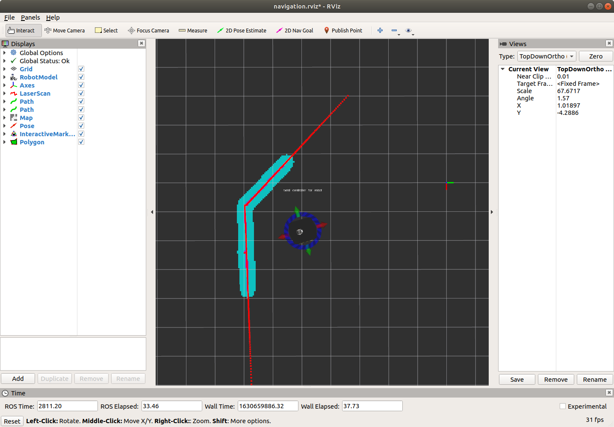
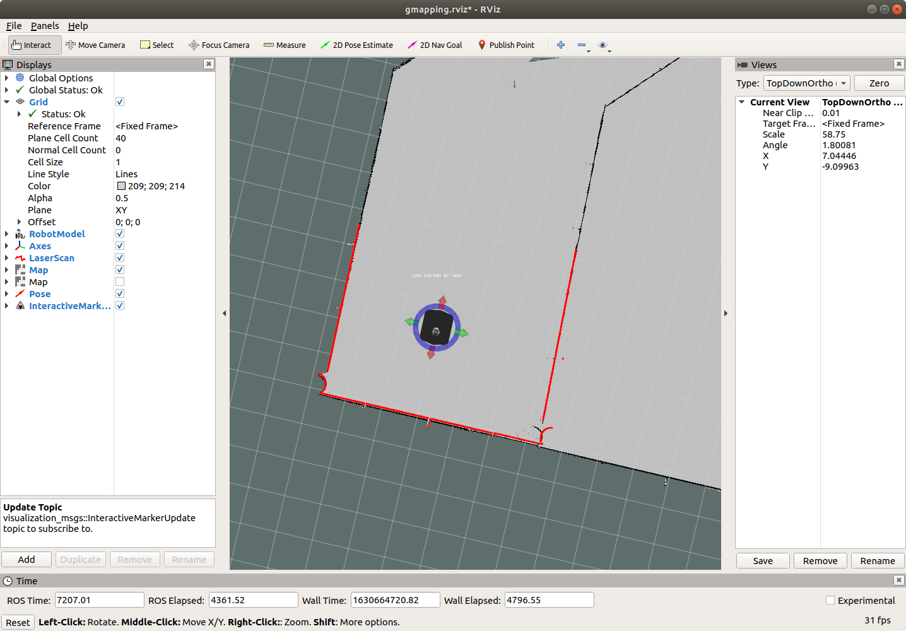
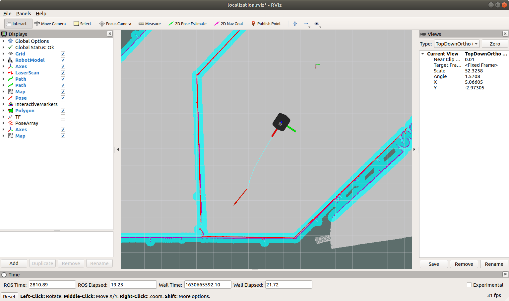
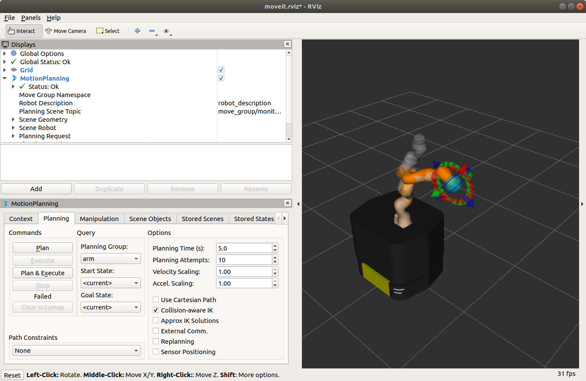
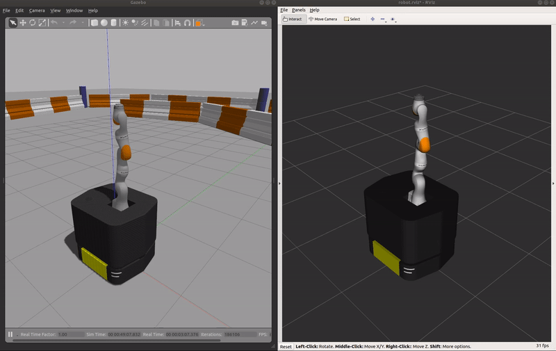

# Demo

Run the following commands in respective terminals.

If you are using simulation, bring up Ridgeback with iiwa in Gazebo:
```sh
roslaunch ridgeback_iiwa_gazebo ridgeback_iiwa_gazebo.launch [world_name:=/path/to/my/world.world]
```

## Navigation

### Navigation without a map


In this demonstration, it takes in information from **odometry**, laser scanner, and a goal pose and outputs safe velocity commands for navigation.

```sh
roslaunch ridgeback_iiwa_navigation odom_navigation.launch
```

The command above is same as the commands below:
```sh
roslaunch ridgeback_navigation odom_navigation_demo.launch
roslaunch ridgeback_iiwa_viz view_robot.launch config:=navigation
```

### Making a map


In this demonstration, Ridgeback generates a map using gmapping. You must slowly drive Ridgeback around to build the map.
```sh
roslaunch ridgeback_iiwa_navigation gmapping.launch
```

The command above is same as the commands below:
```sh
roslaunch ridgeback_navigation gmapping.launch
roslaunch ridgeback_navigation move_base.launch
roslaunch ridgeback_iiwa_viz view_robot.launch config:=gmapping
```


When you are satisfied, you can save the produced map using map saver:
```sh
rosrun map_server map_saver -f mymap
```

This will creat a `mymap.yaml` and `mymap.pgm` files in the directory where you ran the map saver.


### Navigation with a map


Using **amcl**, Ridgeback is able to globally localize itself in a known map. AMCL takes in information from odometry, laser scanner and an existing map and estimates the robot's pose.

```sh
roslaunch ridgeback_iiwa_navigation amcl_navigation.launch [map_file:=/path/to/my/map.yaml]
```

With 2D Pose Estimate and 2D Nav Goal button, navigate through the goal position.

The command above is same as the commands below:
```sh
roslaunch ridgeback_navigation amcl_demo.launch [map_file:=/path/to/my/map.yaml]
roslaunch ridgeback_iiwa_viz view_robot.launch config:=localization
```


## Manipulation

### Manipulation using an interactive marker 


In this demonstration, we launch **move_group** for planning the manipulator. Through rviz, you can manipulate the manipulator.

```sh
roslaunch ridgeback_iiwa_manipulation manipulation.launch
```

The command above is same as the commands below:
```sh
roslaunch ridgeback_iiwa_moveit move_group.launch
roslaunch ridgeback_iiwa_viz view_robot.launch config:=manipulation
```

### Simple manipulation by code


In this demonstration, we launch **move_group** for planning the manipulator. And we call the ROS node we have written, in this case, to move up and down.

```sh
roslaunch ridgeback_iiwa_manipulation simple_manipulation.launch
```

The command above is same as the commands below:
```sh
roslaunch ridgeback_iiwa_moveit move_group.launch
roslaunch ridgeback_iiwa_viz view_robot.launch config:=mobile_manipulation
rosrun ridgeback_iiwa_manipulation simple_manipulation
```

## Mobile manipulation

### Interactive demo

This is a simple example to navigate and manipulate robots with interactive markers.


```sh
roslaunch ridgeback_iiwa_manipulation mobile_manipulation_interactive_demo.launch
```

### Simple mobile manipulation by code

This is a simple example that shows the mobile manipulation by code. The whole point is to launch **move_group**, **move_base**, and **rviz** with correct robot state publisher and controllers.


```sh
roslaunch ridgeback_iiwa_manipulation mobile_manipulation.launch
```

This is same as below:
```sh
roslaunch ridgeback_navigation odom_navigation_demo.launch
roslaunch ridgeback_iiwa_moveit move_group.launch
roslaunch ridgeback_iiwa_viz view_robot.launch config:=mobile_manipulation
```

Then, run the nodes for programming ridgeback and iiwa.

```sh
rosrun ridgeback_examples teleop_key.py
rosrun ridgeback_iiwa_manipulation simple_manipulation
```
