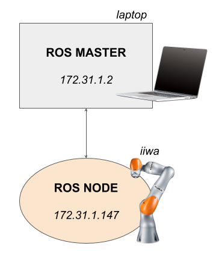
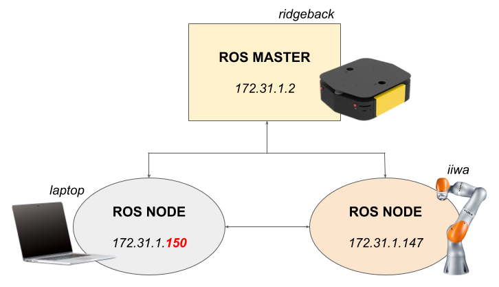

# Network Setup for IIWA

If you have trouble understanding the documentation below, please refer to this [wiki](https://github.com/IFL-CAMP/iiwa_stack/wiki#setup-guide) as supplementary materials.

## Working with IIWA alone

We are setting up your **PC** as a **ROS_MASTER**.



1. Make sure the ethernet cable is connected to **X66 port** of SUNRISE Cabinet. 

2. **(Wired)** Connect network cable to your PC or **(Wireless)** Connect your PC wifi to **COM_GR_5G**.   
   Manually setup the network as below:

	|  Address           | Netmask         | Gateway         |
	|  :---------------: | :-------------: | :-------------: |
	|  172.31.1.2        |  255.255.255.0  |  172.31.1.101   |
   
3. Add following lines to **~/.bashrc**:  
  ```sh
   export ROS_IP=172.31.1.2  
   export ROS_MASTER_URI=http://$ROS_IP:11311
  ```

## Working with IIWA + Ridgeback

We are setting up **Ridgeback** as a **ROS_MASTER**.



1. Make sure the ethernet cable is connected to **X66 port** of SUNRISE Cabinet. 

2. **(Wireless)** Connect your PC wifi to **COM_GR_5G**.   
   Manually setup the network as below:

	|  Address           | Netmask         | Gateway         |
	|  :---------------: | :-------------: | :-------------: |
	|  172.31.1.*150*    |  255.255.255.0  |  172.31.1.101   |

   ⚠️ Make sure the address is not overlapped with your coworkers. Change 150 to anything else but 147 (KUKA cabinet).
   
3. Add following to **~/.bashrc**:   
   ```sh
   export ROS_IP=172.31.1.150 
   export ROS_MASTER_URI=http://172.31.1.2:11311
   ```
   
   Make sure that you put the correct ROS_IP address that you setup in 2.
   
   

## Trouble Shooting

### If your PC is not able to connect to iiwa via wifi

- Check if the ethernet cable is well connected to **X66 port** of SUNRISE Cabinet with the router.
- Check the IP address that iiwa is waiting for when running ROSSmartServo application.
- Check if your PC is correctly connected to the wifi **COM_GR_5G**.
- Check if your PC IP address is correctly configured. Use ```ifconfig```.
