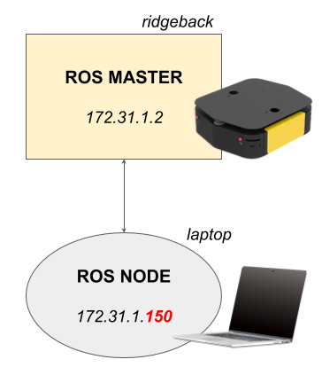

# Network Setup for Ridgeback

Choose either wired or wireless connection you want. If you have trouble understanding the documentation below, please refer to this [tutorial](http://www.clearpathrobotics.com/assets/guides/melodic/ridgeback/network.html) and [video](https://youtu.be/YMG6DWEqv5g) as supplementary materials.

## Wired connection

1.  Open up the user bay and connect a network cable to your PC. You should give yourself an IP address in `192.168.131.X` space. Make sure the address is not overlapped with your coworkers. Below is an example of how to configure your network:

	|  Address           | Netmask         | Gateway         |
	|  :---------------: | :-------------: | :-------------: |
	|  192.168.131.*50*  |  255.255.255.0  |  192.168.131.1  |

3. Make the connection to Ridgeback's default static IP:
	```sh
	ssh administrator@192.168.131.1
	```
	The default password is `clearpath`. You should be logged into Ridgeback as the administrator user.

## Wireless connection

Ridgeback is currently setup to automatically connect to **COM_GR_5G** wifi with a static IP `172.31.1.2` on boot as a **ROS MASTER**.



1. Connect your PC wifi to **COM_GR_5G** and configure a static IP adress in `172.31.1.X` space. Below is an example of how to configure your network:

	|  Address        | Netmask         | Gateway      |
	|  :------------: | :-------------: | :----------: |
	|  172.31.1.*150*  |  255.255.255.0  |  172.31.1.1  |

    ⚠️ Make sure the address is not overlapped with your coworkers. 

2. Make the connection to Ridgeback's wifi static IP:
	```sh
	ssh administrator@172.31.1.2
	```
	The default password is `clearpath`. You should be logged into Ridgeback as the administrator user.

## ROS setup

To successfullly configure bidirectional ROS setup, you will need your computer to be able to connect to Ridgeback's ROS master. Plus, Ridgeback needs to recognize your PC.

1. Add a hostname of Ridgeback in your **PC**:
	```sh
	sudo nano /etc/hosts
	```
2.  Add a following line, an IP adress and a robot's name, to make sure your PC recognize Ridgeback with its name:	
   
      `` 
      172.31.1.2    cpr-r100-0047 
      ``

3.  Add a following line in ~/.bashrc in your **PC**:
	
    ``
    export ROS_MASTER_URI=http://cpr-r100-0047:11311
    ``

4. Add a hostname of your PC in **Ridgeback PC**:
	```sh
	sudo nano /etc/hosts
	```
5.  Add an IP address of your PC that you setup in the above process. This is to make sure Ridgeback recognize your PC. Following is an example. Fill it with your IP address and your PC name: 
    
      ``
      172.31.1.150   laptop
      ``

6. Try [troubleshooting step](./NetworkSetup.md#troubleshooting) to make sure you have bidirectional communication.

## Troubleshooting

### If your PC is not able to connect to Ridgeback via wifi

- Check if the Ridgeback is correctly connected to the wifi **COM_GR_5G**.
- Check if your PC is correctly connected to the wifi **COM_GR_5G**.
- Check the IP address of Ridgeback with `ifconfig`. 
- If it is not properly set, set up the network by following [this step](./StartFromScratch.md#wifi-setup) in Ridgeback PC.

### Check if the bidirectional ROS connection is succesfully set

- [**PC**] Publish a testing chatter topic:
	```sh
	rostopic pub /chatter std_msgs/String "data: 'hello'" -r 10
	```
	
- [**RIDGEBACK**] Check if Ridgeback echos the chatter topic successfully.
	```sh
	rostopic echo /chatter
	```
	If it is giving out 'hello', it means Ridgeback is successfully recognizing your PC.
	
- [**PC**] Check if your PC echos the odometry of Ridgeback succesffully.
	```sh
	rostopic echo /ridgeback_velocity_controller/odom
	```
	If it is giving out the odometry value correclty, it means your PC is successfully recognizing Ridgeback.
