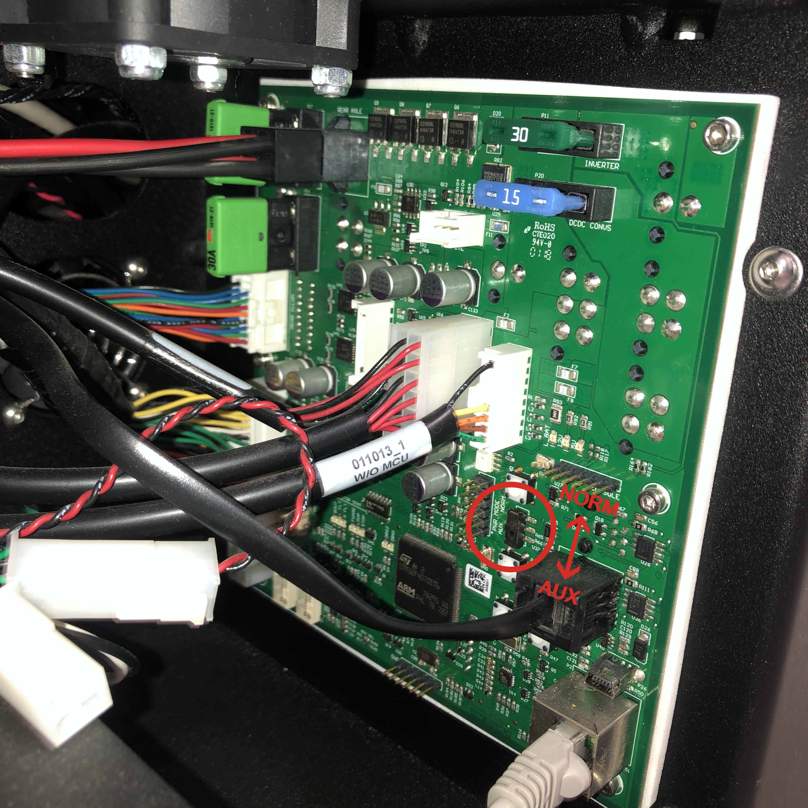
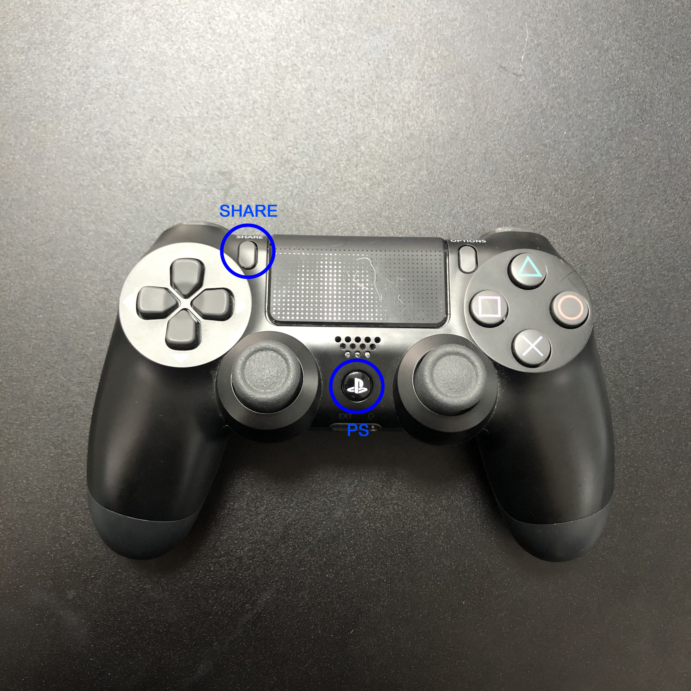

# Starting From Scratch

### :warning: Before you start :warning:

- If you need a back-up, please follow the instruction in [here](http://www.clearpathrobotics.com/assets/guides/kinetic/kinetic-to-melodic/create-backup.html).
- This is for Ridgeback PC, not your remote PC.


## Installing new OS in Ridgeback PC

1.  Create a bootable ISO image. Be aware that not all USB media is suitable for this purpose. If the robot fails to boot from a particular USB stick, try a different one. You can find the latest image in [here](http://packages.clearpathrobotics.com/stable/images/latest/melodic-ridgeback/amd64/).
    
2.  Connect an ethernet cable to the Ridgeback’s computer. The ISO installer will automatically use the Ethernet port on the Ridgeback computer with the earlier/lower MAC address. If the ISO installer fails complaining that it could not get a DHCP address, try the other Ethernet port on the Ridgeback computer.
    
3.  Plug in a monitor and keyboard into the Ridgeback computer.
    
4.  Plug in the ISO installer on the USB stick.
    
	

5.  There is a small two-position switch on the Ridgeback MCU board. Switch the Ridgeback MCU from “NORM” to “AUX” mode.
    
6.  Power on the Ridgeback. The computer may not start up by itself while in AUX mode - force it to boot by pressing the small white button next to the NORM/AUX switch.
    
7.  On the keyboard, immediately start pressing **F7** until the boot option screen appears. There will be a few options, including the Ridgeback’s own SSD as well as two entries for the USB stick. Choose the option that is **NOT UEFI**.
    
8.  The installer should now boot to a purple background with a white foreground, and a progress bar. Allow the ISO installer to complete. It will shut down the computer when it is finished. If a red screen appears claiming that a DHCP address could not be obtained, try switching to the other ethernet port on the Ridgeback computer.
    
9.  Remove the USB stick but leave the monitor and keyboard attached. Restart the computer by pressing the small white button again.
    
10.  On boot, the system will ask you to log in. Enter the name **administrator** and the password **clearpath**
    
11.  The system will now ask for a new hostname. The default hostname would normally be **cpr-r100-0047** but you can make it whatever you like.
    
12.  After entering the new hostname the system will restart again.
    
At this point, it should be possible to SSH into the robot instead of using a keyboard and monitor. 
 
 
 
## ROS components Installation

1.  Install the ridgeback ROS components.
	```sh
	rosrun ridgeback_bringup install
	```
    
2.  Open the setup.bash file.
	```sh
	sudo nano /etc/ros/setup.bash
	```
    
3.  Below the ###### marks, add the following lines:

	``
	export RIDGEBACK_PS3=0  
	``
	
	``
	export RIDGEBACK_FRONT_HOKUYO_LASER=1
	``
	
	 Save and exit the file. 

4. Then run the below command again.
	```sh
	rosrun ridgeback_bringup install
	```

   
## Wifi Setup    
1. Launch the wifi control software.
	```sh
	wicd-curses
	```
    
2.  Press **P** (capital P) for preferences. Find the wired-internet line and remove whatever is there (wicd-curses is only used to control the wifi interface). Press **F10** to save. 
3. Then press **R** to scan for available networks. The screen may blink two or three times. Use the up and down arrow keys to find your desired network. Then the right arrow key to select it. Select the option to *use the computer’s hostname*, and the option to *automatically connect to the network*. Then, add the password for the network. Press **F10** to save. 
4. With the network you just selected highlighted, press **C** to connect. After a few moments you should see the selected line turn green, and an IP address will appear at the bottom. 
5. Press **Q** to exit wicd-curses.


## Bluetooth Setup 

1.  Open the bluetooth pairing utility.
	```sh
	sudo bluetoothctl
	```

	
    
2.  Put the PS3 controller into pairing mode. Press and hold both the SHARE button and the PS button. The light bar at the top of the controller will start to blink.


3. Then on the computer type the following commands:
	```sh
	agent on  
	scan on
	```

4. Wait a few seconds, then type
	```sh
	scan off
	```
	At this point you should have a list of pairable devices, along with their hexadecimal addresses. Find the one called Wireless Controller and copy its address.

5. With the controller still in pairing mode, type:
	```sh
	trust [address of controller]
	connect [address of controller]
	```
	
6. If everything worked, then bluetoothctl will indicate that the controller was successfully paired. And, the light on the PS3 controller will turn solid. 

7. Exit bluetoothctl with the command ``exit``.

8. Hold on to the PS button to turn ON/OFF the controller.

## Last Step
Turn off the Ridgeback. Flip the NORM/AUX switch back to NORM. Start the Ridgeback again. This should complete the basic bring-up of the system, with the following conditions true:

-   the computer boots automatically
-   the Ridgeback has a static IP address of **192.168.131.1**
-   the Ridgeback connects automatically to your desired network
-   the PS3 controller connects to the Ridgeback when powered on
-   the ridgeback can be brought out of e-stop mode by releasing all the e-stops and pressing “e-stop reset” button on the rear panel
-   on e-stop reset, the front lights are white, and the rear lights are red. If the Ridgeback is charging, then all lights will be green
-   the ridgeback is controllable with the PS3 controller
